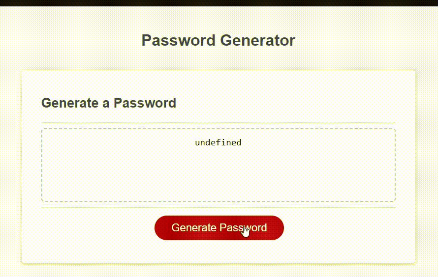

#Description
The goal of this project was to create a password generator for a client. 

For this password generator, we ask the user to enter in a valid password length from a minimum of 8 characters to a maximum of 128 characters. 

From there we ask the user if they should include uppercase letters, lowercase letters, numerals and/or special characters. 

If the user does not make any valid inputs, the program notifies the user and asks them to try again. 

Based on valid user input, the code will spit out a password within the criterias the user set into the program.

#User Story
AS AN employee with access to sensitive data
I WANT to randomly generate a password that meets certain criteria
SO THAT I can create a strong password that provides greater security
#Acceptance Criteria
GIVEN I need a new, secure password
WHEN I click the button to generate a password
THEN I am presented with a series of prompts for password criteria
WHEN prompted for password criteria
THEN I select which criteria to include in the password
WHEN prompted for the length of the password
THEN I choose a length of at least 8 characters and no more than 128 characters
WHEN asked for character types to include in the password
THEN I confirm whether or not to include lowercase, uppercase, numeric, and/or special characters
WHEN I answer each prompt
THEN my input should be validated and at least one character type should be selected
WHEN all prompts are answered
THEN a password is generated that matches the selected criteria
WHEN the password is generated
THEN the password is either displayed in an alert or written to the page
Images
Website Preview Image

#Link URL to deployed webpage on GitHub

#Capture of working program

#Installation
N/A

#Technologies Used
VS Code
Github

#Credits
Institution: The University Of Toronto
Course: Bootcamp Full Stack Development
Instructor: Daler Singh
Student Peer Help: Sahil Banati
#License
NA